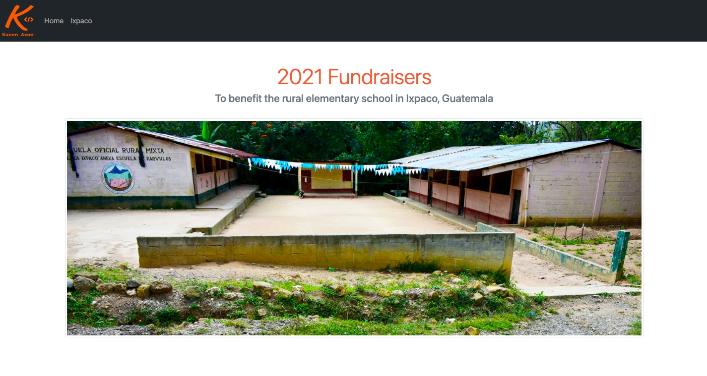

# Ixpaco Elementary School Fundraisers
This website was created to communicate the needs and to raise funds for projects to benefit the rural elementary school in Ixpaco, Guatemala.
#### By Karen Axon

## Technologies Used
* HTML
* CSS
* Bootstrap

## Setup/Installation
* Click on the link to my [repository](https://github.com/karenaxon/fundraiser.git).
* Click on the green "Code" button and copy the repository URL.
* Open your terminal and use the command: git clone https://github.com/karenaxon/fundraiser.git into the directory you would like to clone the repository.
* Open in your favorite text editor to view code and make changes.

## Known Bugs
* None

## License

[MIT](https://choosealicense.com/licenses/mit/)

Copyright (c) October, 2021 - Karen Axon

## Contact Information:

<h3>Karen Axon</h3>

